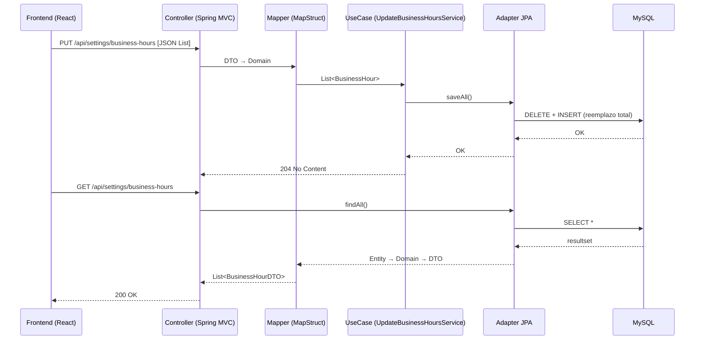

# 🧩 BusinessHours: documentación del flujo (parte del backend monolítico)

## 🎯 Objetivo
La funcionalidad de BusinessHours pertenece al backend monolítico de la Rotisería (no es un módulo o microservicio aparte). Gestiona los horarios de atención desde el panel administrativo y sigue el estilo hexagonal usado en el proyecto.

---

## ⚙️ 1) Datos esperados desde el Frontend

Endpoint (protegido):
- GET /api/settings/business-hours
- PUT /api/settings/business-hours

Ejemplo de request (PUT):
```json
[
  {
    "dayOfWeek": "Lunes",
    "enabled": true,
    "ranges": [
      { "open": "11:00", "close": "15:00" },
      { "open": "19:00", "close": "23:00" }
    ]
  },
  {
    "dayOfWeek": "Martes",
    "enabled": false,
    "ranges": []
  }
]
```
DTOs:
- BusinessHourDTO: { id?, dayOfWeek, enabled, ranges: BusinessHourRangeDTO[] }
- BusinessHourRangeDTO: { open, close }

---

## 🧭 2) Flujo de datos (end-to-end)

1) Controller (privado)
- Ruta base: `/api/settings/business-hours`
- Recibe/envía DTOs y delega en casos de uso.

2) Mapper (MapStruct)
- Interfaz: `BusinessHourMapper`.
- Mapea dominio ↔ entidad, incluyendo los rangos:
```java
@Mapper(componentModel = "spring")
public interface BusinessHourMapper {
    BusinessHourDTO toDto(BusinessHour domain);
    BusinessHour toDomain(BusinessHourDTO dto);

    @Mapping(target = "ranges", source = "ranges")
    BusinessHourEntity toEntity(BusinessHour domain);

    @Mapping(target = "ranges", source = "ranges")
    BusinessHour toDomain(BusinessHourEntity entity);

    @Mapping(target = "openTime", source = "open")
    @Mapping(target = "closeTime", source = "close")
    BusinessHourEntity.RangeEmbeddable toEmbeddable(BusinessHour.Range range);

    @Mapping(target = "open", source = "openTime")
    @Mapping(target = "close", source = "closeTime")
    BusinessHour.Range toRange(BusinessHourEntity.RangeEmbeddable embeddable);
}
```
Nota: El mapeo de rangos es explícito (open ↔ openTime, close ↔ closeTime) para persistir correctamente la `@ElementCollection`.

3) Dominio
- Modelo `BusinessHour` con `id`, `dayOfWeek`, `enabled`, `ranges` (Range { open, close }).
- Existen validaciones en el factory `BusinessHour.of(...)`, pero el flujo actual usa mapeo por setters/constructor sin invocar ese factory de forma automática.

4) Caso de uso (Application)
```java
@Service
public class UpdateBusinessHoursService implements UpdateBusinessHoursUseCase {
    @Transactional
    public void updateAll(List<BusinessHour> hours) {
        repository.saveAll(hours);
    }
}
```
- Transaccional y sin conocimiento de JPA.

5) Adaptador de persistencia (JPA)
```java
@Component
public class BusinessHourRepositoryAdapter implements BusinessHourRepositoryPort {
    @Override
    public List<BusinessHour> findAll() { /* jpa.findAll → mapper.toDomain */ }

    @Override
    public void saveAll(List<BusinessHour> hours) {
        jpaRepository.deleteAll();
        jpaRepository.saveAll(hours.stream().map(mapper::toEntity).toList());
    }
}
```
- Comportamiento actual: reemplazo total (deleteAll + saveAll), atómico por transacción. Puede cambiar IDs.

6) Entidad JPA
```java
@Entity
@Table(name = "business_hours")
@Getter @Setter
public class BusinessHourEntity {
    @Id @GeneratedValue(strategy = GenerationType.IDENTITY)
    private Long id;
    private String dayOfWeek;
    private boolean enabled;

    @ElementCollection
    @CollectionTable(name = "business_hour_ranges", joinColumns = @JoinColumn(name = "business_hour_id"))
    private List<RangeEmbeddable> ranges;

    @Embeddable @Getter @Setter
    public static class RangeEmbeddable {
        @Column(name = "open_time")
        private String openTime;
        @Column(name = "close_time")
        private String closeTime;
    }
}
```
Tablas esperadas:
```sql
CREATE TABLE business_hours (
  id BIGINT AUTO_INCREMENT PRIMARY KEY,
  day_of_week VARCHAR(20),
  enabled BOOLEAN
);

CREATE TABLE business_hour_ranges (
  business_hour_id BIGINT,
  open_time VARCHAR(10),
  close_time VARCHAR(10),
  FOREIGN KEY (business_hour_id) REFERENCES business_hours(id)
);
```

---

## 🔐 3) Seguridad y Swagger
- Estos endpoints son PRIVADOS (requieren login). Aparecen en Swagger y son consumibles tras autenticarse.
- Los endpoints públicos del catálogo están bajo `/api/public/**` y se muestran sin autenticación; BusinessHours no es público.

---

## 🧪 4) Validaciones y manejo de errores
- El dominio tiene validaciones en `BusinessHour.of(...)`, pero el flujo actual no lo invoca automáticamente; si querés hacerlas efectivas, invócalo en el caso de uso o agrega un validador.
- El `GlobalExceptionHandler` no mapea `IllegalArgumentException` a 400 por defecto; si se lanzara, caería en el handler genérico (500). Recomendado: agregar un handler específico si se habilitan validaciones de dominio.

---

## 📤 5) Respuestas típicas
GET /api/settings/business-hours → 200 OK con `List<BusinessHourDTO>`.
PUT /api/settings/business-hours → 204 No Content tras aplicar el reemplazo.

---

## 🔁 6) Resumen del flujo (Mermaid)


---

## ✅ Conclusiones
- BusinessHours es parte del backend monolítico (no un módulo separado).
- Endpoints privados bajo `/api/settings/business-hours`.
- Mapeo de rangos explícito asegura persistencia correcta.
- Reemplazo total simplifica la escritura, pero puede cambiar IDs; si hay dependencias, migrar a update selectivo.
- Para validar/rechazar datos desde dominio, integrar `BusinessHour.of(...)` y mapear `IllegalArgumentException` a 400.

